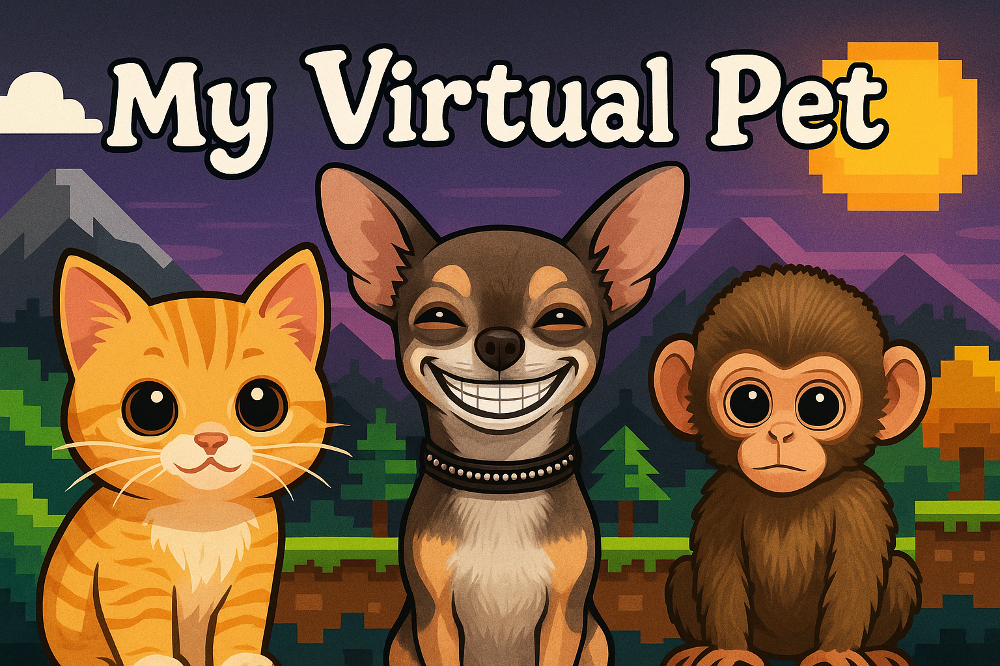
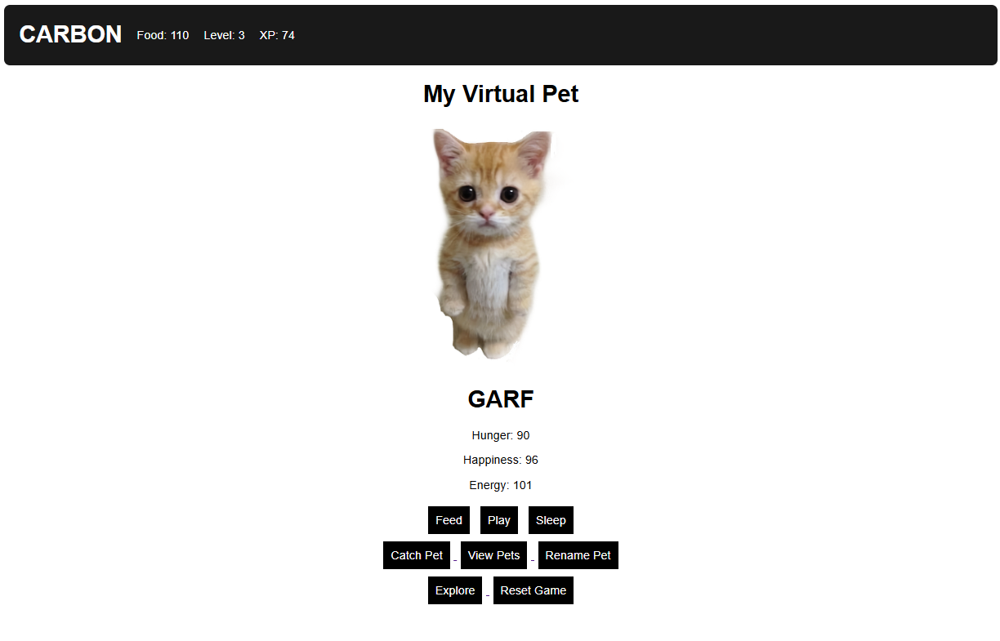
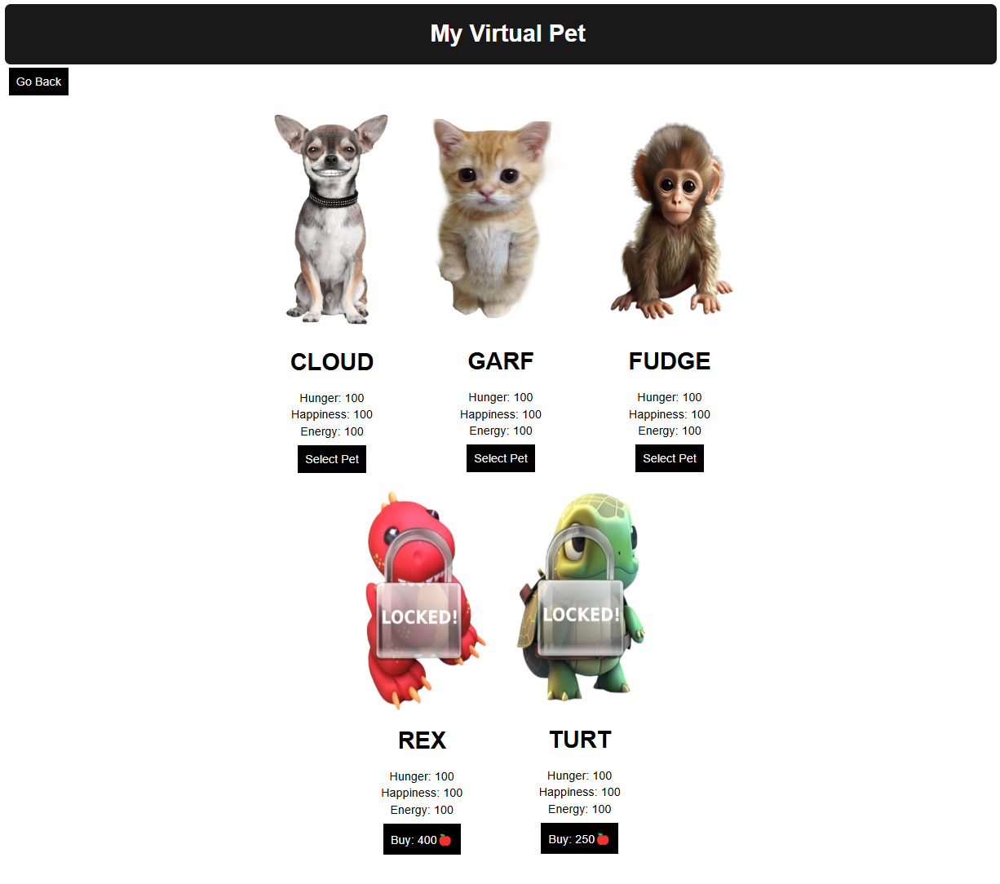
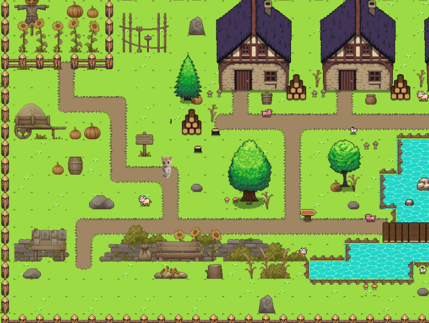

    

<h1 align="center">🐾 My Virtual Pet 🐾</h1>

<i>A Tamagotchi-style pet simulation game</i>
 

**My Virtual Pet** is a Tamagotchi-style game where the player starts by choosing one of three starter pets. After selecting a pet, the player has the option to name it.

Once the player has selected their starting pet, the player is then taken to the home screen where they can see:
- The current pet and its stats
- Pet interaction buttons (feed, play, sleep, catch pet, view pets, rename pet)
- Player stats displayed in the top-left corner 

---

### Goal of The Game
The goal of the game is to keep your pets stats from reaching zero by:
- Feeding it
- Letting it rest
- Playing mini-games 

As you progress, you can unlock new pets through:
- Buying them with food/points
- Reaching certain levels
- Catching hidden pets

---

## Mini-Games 
Players can earn food/points and XP by playing one of three available survival-based mini-games. Each mini-game increases in difficulty as you go, but the food/points also increase in value. 
- Dodge Ball Survival
- Runner Survival 
- Escape Survival 

---

## Pet Management 
Players can:
- View all unlocked/locked pets
- Switch between owned pets
- Purchase new pets with food/points 
- Unlock exclusive pets by leveling up 

--- 

## Catching Random Pets 
Players can explore the map to find hidden pets. Players only get **one attempt per day**  to:
- Find the hidden pet within a time limit
- Collect food/points and a special key during the search 
- Use the key to unlock a chest for bonus rewards 

If a pet is successfully found, it can be named and will become the active pet-regardless of whether it normally requires a level or purchase to unlock and will be auto unlocked for the player so they can switch back and forth between it and their other pets. 

---

## Ongoing Development
This is a personal project created for fun to help sharpen my programming skills and creativity. I plan to continue improving it by adding:
- New pets
- Additional mini-games
- Expanded gameplay 
- More interactive pet features 
- Updated visuals / styling  
- Complete implementation of new catch pet system                                             

---

## Tech Used
- **JavaScript**
- **HTML**
- **CSS**
- **Phaser**

---

## How to Run
To run locally:
1. Open a terminal in the project directory 
2. Start a local server with python: "python -m http.server 8000"
3. Open a browser and go to: "http://localhost:8000/home.html"

This will take you to the home screen where you can start by entering your username and choosing a pet.

---

## Screenshots 
Home Page / Pet Interaction Scene 

View / Select Pets Scene

Catch A Pet Scene
